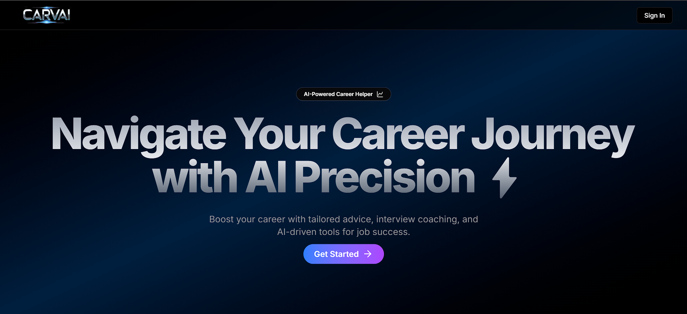

# CarvAi – AI-Powered Career Helper



## 🌟 Overview
🚀 **CarvAi** is an AI-powered career helper designed to help professionals and job seekers with resume building, industry insights, online assessments, and cover letter generation. With a modern UI and AI-driven capabilities, it simplifies career development effortlessly.

## 🌟 Features
* ✅ **Industry Insights** – Get real-time job market trends
* ✅ **AI Resume Builder** – Generate professional resumes tailored to job roles
* ✅ **Online Assessments** – Test your skills with AI-generated assessments
* ✅ **Cover Letter Generator** – Create personalized cover letters in seconds
* ✅ **Interactive Graphs** – Gain career insights with **Recharts-powered** visualizations
* ✅ **Modern UI** – Sleek, user-friendly, and responsive design with **ShadCN & TailwindCSS**
* ✅ **Secure Authentication** – Powered by Clerk
* ✅ **Scalable & Efficient** – Prisma, NeonDB, and Inngest ensure smooth performance

## 🔗 Live Demo
Check out **CarvAi** in action: **[Live Link](https://carv-ai.vercel.app)** 🚀

## 💻 Tech Stack
| Category       | Technology                     |
|---------------|--------------------------------|
| **Frontend**  | Next.js, TailwindCSS, ShadCN   |
| **Backend**   | Next.js Server Actions, Prisma     |
| **AI**        | Gemini API                     |
| **Database**  | NeonDB                          |
| **Charts**    | Recharts                        |
| **Auth**      | Clerk                           |
| **Automation**| Inngest                         |
| **Deployment**| Vercel                          |

## 📥 Installation
### Clone the repository:
```bash
git clone https://github.com/anjany06/carvAi.git
cd carvAi
```
### Install dependencies:
```bash
npm install
```
### Set up environment variables:
1. Copy `.env.example` to `.env`
2. Add required keys

### Initialize the database:
```bash
npx prisma generate
npx prisma migrate dev
```
### Start the development server:
```bash
npm run dev
```

## 🤝 Contribution Guidelines
### 🌱 How to Get Involved
1. Fork the repository.
2. Clone your fork:
   ```bash
   git clone https://github.com/anjany06/carvAi.git
   ```
3. Create a new branch:
   ```bash
   git checkout -b feature/<feature-name>
   ```
4. Make changes and commit:
   ```bash
   git add .
   git commit -m "Your descriptive commit message"
   ```
5. Push changes:
   ```bash
   git push origin <your-branch-name>
   ```
6. Open a pull request.

### 📌 Suggested Contributions
- Improve **Career Insights Analytics** – Add more data sources & visualizations.
- Enhance **Resume Builder** – Integrate advanced AI-driven resume formatting.
- Add **More Templates** – Provide customizable resume & cover letter templates.
- Optimize Performance – Improve loading times and database efficiency.

## 🌟 Stargazers & Forkers
We appreciate your support! 🌟🍴

## 🛡 License
carvAi is licensed under the **MIT License**.

## 📬 Contact
For queries or collaborations:
📧 **Email:** anjany.pandey06@gmail.com
💼 **LinkedIn:** [https://www.linkedin.com/in/anjany-pandey-927169294/](https://www.linkedin.com/in/anjany-pandey-927169294/)  
🐦 **Twitter/X:** [https://x.com/anjany06](https://x.com/anjany06)
